# Git 작업 스킬

## 이 스킬이 필요할 때

- Git commit 메시지 작성
- Pull Request 생성
- PR/MR 코드 리뷰
- 리뷰 피드백 반영

## 관련 문서

| 주제 | 위치 | 설명 |
|-----|------|------|
| Commit/PR 생성 | `git.md` | 메시지 형식, PR 작성법, 브랜치 전략, 안전 규칙 |
| PR 리뷰 | `pr-review.md` | 체크리스트 기반 코드 리뷰 워크플로우 |
| PR 피드백 적용 | `pr-apply.md` | 리뷰 피드백 분류 및 반영 방법 |

## 빠른 참조

### Commit PREFIX

| PREFIX | 용도 |
|--------|------|
| FEAT | 새로운 기능 |
| FIX | 버그 수정 |
| REFACTOR | 리팩토링 |
| CHORE | 빌드/설정 |
| DOCS | 문서 |

> 상세 형식 및 예시: `git.md`

### PR 타이틀

- PREFIX 없이 간결하게 작성
- 예시: `결제 완료 후 주문 저장 구현`, `로그인 세션 만료 오류 수정`

### PR 본문 구조

| 섹션 | 설명 |
|------|------|
| 📋 Summary | 핵심 변경 1-2문장 요약 |
| 🔄 주요 변경사항 | 파일별 변경 내용 |
| ⚠️ 사이드 이펙트 | 다른 영역 영향 분석 |
| 🔀 변경 흐름 | mermaid 다이어그램 (선택) |

### PR 워크플로우

```mermaid
graph LR
  A[변경사항 분석] --> B[영향 분석]
  B --> C[PR 작성]
  C --> D[Self Review]
  D --> E[팀원 리뷰]
  E --> F[Merge]
```

> 상세 Step: `git.md`
