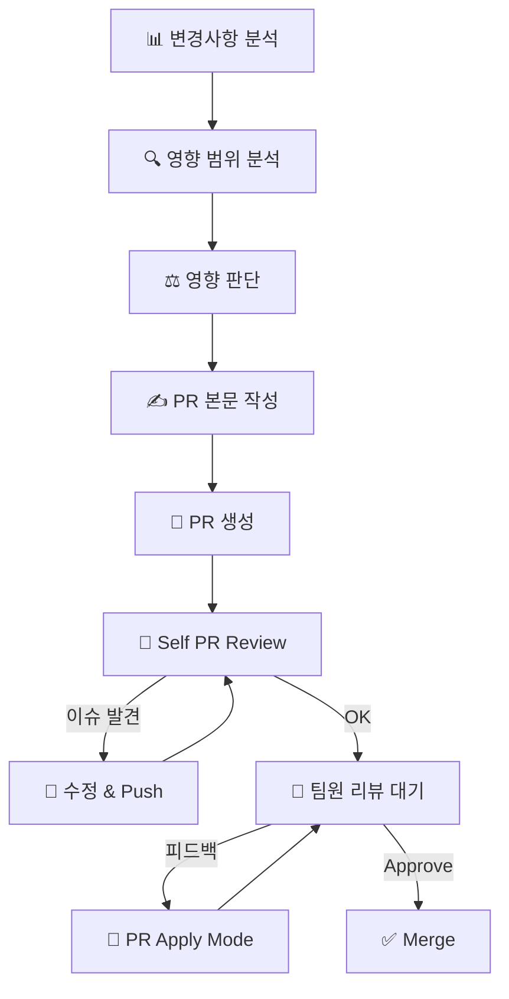

# Git 작업 가이드

## Commit 메시지

### 형식

```
<PREFIX>: <간결한 요약 (한글)>

<본문 (선택)>

Co-Authored-By: Claude <noreply@anthropic.com>
```

### PREFIX

| PREFIX | 용도 | 예시 |
|--------|------|------|
| FEAT | 새로운 기능 | `FEAT: 결제 완료 후 주문 저장 구현` |
| FIX | 버그 수정 | `FIX: 로그인 세션 만료 오류 수정` |
| REFACTOR | 리팩토링 | `REFACTOR: Order Entity 패턴 적용` |
| CHORE | 빌드/설정 | `CHORE: ESLint 설정 업데이트` |
| DOCS | 문서 | `DOCS: README 설치 가이드 추가` |
| STYLE | 포맷팅 | `STYLE: ESLint 경고 수정` |
| TEST | 테스트 | `TEST: 주문 생성 단위 테스트 추가` |

### 작성 원칙

- **한글 사용**, 50자 이내
- **현재형**: "추가함" → "추가"
- **Why 중심**: 무엇보다 왜 변경했는지

### Commit 단위

- 한 커밋 = 한 가지 목적
- 각 커밋 후 빌드 에러 없음
- 되돌리기 용이한 단위

---

## 브랜치 전략

```
feature/{기능명}     # 새 기능
fix/{버그명}         # 버그 수정
refactor/{대상}      # 리팩토링
chore/{작업명}       # 설정/빌드
```

---

## PR (Pull Request) 생성

### Step 1: 변경사항 분석

```bash
git status                    # 변경된 파일
git diff main...HEAD          # main 대비 전체 변경
git log main..HEAD --oneline  # 커밋 히스토리
```

### Step 2: 영향 범위 분석

**필수: PR 작성 전 다른 코드에 미치는 영향 분석**

| 변경 유형 | 확인 사항 |
|----------|----------|
| API Output 변경 | 프론트엔드 호출 코드 |
| API Input 변경 | mutation/query 사용처 |
| 공유 타입 변경 | 타입 패키지 사용처 |
| Entity 컬럼 변경 | Repository, Service, Migration |
| 컴포넌트 Props 변경 | import하는 모든 파일 |
| 유틸 함수 시그니처 변경 | 함수 호출처 |
| 환경 변수 추가 | `.env.example`, 배포 설정 |

```bash
# 변경된 export 사용처 검색
grep -r "import.*변경된함수명" --include="*.ts" --include="*.tsx"
```

### Step 3: 영향 판단

**필수: 변경사항이 시스템에 미치는 영향 분석**

#### Code Flow 분석

```
변경된 함수/컴포넌트 → 호출하는 곳 → 그 호출자의 호출자 → ...
```

- 변경된 코드를 호출하는 모든 경로 추적
- 데이터 흐름 변경 시 downstream 영향 확인
- 에러 전파 경로 확인

#### User Flow 분석

| 질문 | 확인 |
|------|------|
| 어떤 페이지/기능에 영향? | 영향받는 화면 목록 |
| 사용자 동선 변경? | 기존 UX 유지 여부 |
| 에러 시 사용자 경험? | 에러 메시지, 폴백 처리 |

#### Breaking Change 판단

```markdown
## Breaking Change 여부: 없음 / 있음

### 있다면:
- **무엇이**: 변경된 인터페이스/동작
- **어디에 영향**: 영향받는 코드 목록
- **마이그레이션**: 필요한 수정 작업
```

### Step 4: PR 본문 작성

```markdown
## 📋 Summary

> 이 PR이 해결하는 문제와 접근 방식을 1-2문장으로 설명

## 🔄 주요 변경사항

### [변경 제목 1]
**파일:** `path/to/file.ts`
- 변경 내용 설명

### [변경 제목 2]
**파일:** `path/to/file.ts`
- 변경 내용 설명

## ⚠️ 사이드 이펙트

> 이 변경으로 인해 다른 부분에 발생할 수 있는 영향

| 영향 받는 영역 | 영향 내용 | 위험도 |
|---------------|----------|--------|
| 없음 | - | - |

## 🔀 변경 흐름


Generated with [Claude Code](https://claude.ai/code)
```

### Step 5: PR 생성

```bash
git push -u origin feature/branch-name

gh pr create --base main --title "<간결한 제목>" --body "$(cat <<'EOF'
## Summary
...
EOF
)"
```

---

## Git 명령어 주의사항

### 금지

| 명령어 | 이유 |
|--------|------|
| `git add -A`, `git add .` | 민감 파일 포함 위험 |
| `git push --force` | 히스토리 손상 |
| `git reset --hard` | 작업 손실 위험 |
| `--no-verify` | hook 우회 금지 |

### 권장

```bash
# 파일 지정하여 add
git add path/to/file1.ts path/to/file2.ts

# HEREDOC으로 커밋
git commit -m "$(cat <<'EOF'
FEAT: 기능 설명

상세 내용

Co-Authored-By: Claude <noreply@anthropic.com>
EOF
)"
```

---

## PR 생성 전 체크리스트

- [ ] `lint` 통과
- [ ] `build` 성공
- [ ] 커밋 메시지 규칙 준수
- [ ] Summary가 변경 내용을 명확히 설명
- [ ] 영향 범위 분석 완료
- [ ] Breaking change 명시 (해당시)

---

## PR 생성 후 워크플로우

### Step 6: Self PR Review

PR 생성 직후 본인이 먼저 리뷰합니다.

```bash
# PR diff 확인
gh pr diff <PR번호>

# PR 상세 확인
gh pr view <PR번호>
```

**Self Review 체크리스트:**

| 항목 | 확인 |
|------|------|
| 불필요한 코드/주석 제거 | ☐ |
| 디버그 코드 제거 (console.log 등) | ☐ |
| 하드코딩된 값 없음 | ☐ |
| 타입 안전성 확인 | ☐ |
| 에러 핸들링 적절함 | ☐ |
| 네이밍 컨벤션 준수 | ☐ |

> 상세 체크리스트: `.claude/skills/Git/pr-review.md`

**Self Review 이슈 발견 시:**

```bash
# 수정 후 추가 커밋
git add <수정파일>
git commit -m "$(cat <<'EOF'
FIX: Self review 피드백 반영

- 수정 내용 1
- 수정 내용 2

Co-Authored-By: Claude <noreply@anthropic.com>
EOF
)"
git push
```

### Step 7: PR Apply Mode (리뷰 피드백 적용)

팀원 리뷰 후 피드백이 있으면 pr-apply 모드로 진입합니다.

```bash
# 리뷰 코멘트 확인
gh pr view <PR번호> --comments

# 피드백 분류
# Critical - 반드시 수정
# Suggestion - 검토 후 결정
# Question - 답변 필요
```

**피드백 반영:**

```bash
# 코드 수정 후 커밋
git add <수정파일>
git commit -m "$(cat <<'EOF'
FIX: PR 리뷰 피드백 반영

- [Critical] 피드백1 반영
- [Suggestion] 피드백2 반영

Co-Authored-By: Claude <noreply@anthropic.com>
EOF
)"
git push

# 리뷰어에게 알림
gh pr comment <PR번호> --body "리뷰 피드백 반영 완료. 재확인 부탁드립니다."
```

> 상세 가이드: `.claude/skills/Git/pr-apply.md`

---

## 전체 PR 워크플로우 요약



### 관련 Skill 참조

| 단계 | Skill |
|------|-------|
| PR Review | `.claude/skills/Git/pr-review.md` |
| PR Apply | `.claude/skills/Git/pr-apply.md` |
